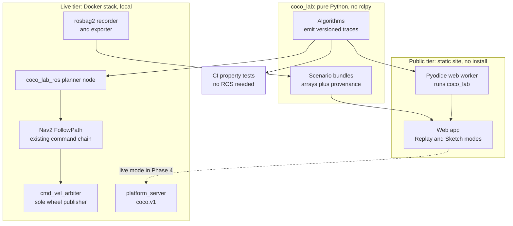

# COCO Lab — roadmap

> **Status, 2026-09-28: Phase 0 not started.**
> This roadmap supersedes the priority order in the COCO 2.0 master context
> (§45). Everything else in that document — its invariants, protected files
> and git rules — still holds. The previous roadmap is archived at
> [`docs/history/ROADMAP_COCO2.md`](history/ROADMAP_COCO2.md).
>
> Session prompts: [`docs/LAB_PHASES.md`](LAB_PHASES.md) ·
> Current state: [`docs/SESSION_LOG.md`](SESSION_LOG.md) ·
> Measured results: [`docs/RESULTS.md`](RESULTS.md)

Numbers in this document are **targets** unless marked **(measured)** with a
pointer to `RESULTS.md`. Week counts are part-time estimates, not
measurements. "COCO Lab" is a working title; Phase 0 picks a name people can
actually search for.

---

## 1. What COCO Lab is

**An interactive, browser-based robotics curriculum that runs on a real ROS 2
robot.**

The well-known algorithm visualisers stop at the grid. PathFinding.js and Red
Blob Games show search spreading over cells. PythonRobotics animates filters
and SLAM as recordings you can't interact with. RViz and Foxglove show
whatever a robot publishes, and Nav2's planners don't expose their search as
something a learner can step through. COCO Lab sits in that gap, and it can
show two things none of them can:

- **The textbook-to-robot gap.** The grid path solves the textbook problem.
  Then a robot with a real footprint, an inflated costmap, a local controller
  and imperfect localisation has to drive it. The difference between the line
  and what the robot actually does is where most of robotics lives.
- **The belief-to-truth gap.** What the robot thinks versus where it really
  is. Only a simulator knows the truth, and EpisodeSpec already enforces the
  boundary in code: the manifest is privileged, and `task_view` is all the
  robot gets. The platform turns that anti-cheat invariant into a "show
  truth" toggle.

The mental model is a cutaway engine in a museum: you watch the pistons move,
and it actually runs.

**One principle holds it together: same inputs, different algorithm, measured
outputs.** Every comparison fixes the map, start, goal, recorded drive and
seed — the discipline of the 1,080-episode baseline matrix, applied to
teaching. Every scenario is an EpisodeSpec, so every scenario is a
reproducible, shareable link.

### What it is not

- **Not a game-engine imitation of a robot.** The robot runs the real ROS 2 /
  Nav2 stack. The browser displays and asks; it never decides.
- **Not a replacement for the stack.** Every lab ties back to something the
  real robot did, recorded with provenance.
- **Not, yet, a hosted multi-user service.** The public tier is a static
  site; live sessions run locally (§3.5).

---

## 2. Why the direction changed

The master context's priority order — P0.4, then cross-simulator generation
and Isaac, then dynamic obstacles, then learning, then a multi-user browser
platform — was sequenced for an **autonomy research platform**. For a
**learning platform**, the value comes from different places: access without
installing anything, algorithm internals made visible, and comparisons that
are honest because their inputs are fixed. The existing work maps onto that
almost entirely. It needs reordering, not replacing.

The project also already owns its best teaching material, in the form of
measured, documented failures:

| Documented result | Concept it teaches | Lab |
|---|---|---|
| AMCL `recovery_alpha_fast/slow` = 0.0, so it cannot escape a confident wrong mode | Particle injection | 2 |
| Global relocalisation converged inside the ramp footprint on a self-similar map | Perceptual aliasing | 2 |
| AMCL covariance moved the wrong way at divergence | Filter overconfidence; covariance is not health | 2 |
| Coulomb friction not identifiable: τ spans 0.0003 across a μ span of 0.35 | Observability | Later (Estimate) |
| SmacPlanner2D path 6.2% shorter than NavFn's (M3) | Implementation vs algorithm | 1 |
| Run 15: after AMCL drifted, DWB scored 0 of 819 trajectories | Local planning under bad localisation | 5 |
| B2, a gain-scheduled PD with privileged terrain, at 98% on Route A | When learning isn't needed | Later (Learn) |

### Disposition of the previous priority order

| Previous item | Now | Reason |
|---|---|---|
| P03C consolidation | Done; lands on `main` in Phase 0 | Not yet on the remote |
| P0.4 autonomous discovery | **Phase 4**, as Lab 4 (Search) | Search under uncertainty is a belief problem and teaches better after Localise and Map. The master context's design (§17–25) is unchanged; it is built visualisation-first |
| Cross-simulator scene generation; full Isaac backend | **Deferred** (§9) | 6 GB VRAM limits already hit (LLVM, OOM); little learner value from a second renderer; cross-engine rigour already shown — 0.242 mm MuJoCo–Gazebo parity (measured) |
| Dynamic obstacles | **Phase 5**, in Lab 5 (Move) | Apron only, per the M7_DESIGN §2.6 spec |
| Advanced learning / RL | **Later lab** (Learn) | Phase 3 and C2-M2 measured that RL isn't justified on this task; that finding is the lesson |
| Browser expansion: multi-user, remote execution, cloud | **Deferred** (§9) | The static public tier delivers most of the value at zero running cost |

---

## 3. Architecture

### 3.1 `coco_lab` — the core

Pure Python, **no `rclpy`**, with a standard-library-only runtime in Phase 1
(numpy may be added later if a lab measurably needs it). It builds with colcon
**and** installs with pip in a ROS-free venv; CI proves the second.

Algorithms operate on a generic graph interface — neighbours, edge cost,
heuristic — and the grid is one implementation. That is what lets a
*(cell, heading)* state space, and later Hybrid A\*, reuse the same code.

The same code runs in three places: CI, where property tests prove it; the
browser, via Pyodide in a Web Worker; and a ROS node, where it plans for the
real robot.

### 3.2 Traces and scenario bundles

- **Trace.** Every algorithm emits a versioned, columnar event stream (push,
  expand, relax, path) carrying cell, g, h and parent, plus a summary:
  expansions, path cost, path length, status. Later labs add event types —
  particle sets, pose-graph iterations — under the same versioning rule.
- **Bundle.** `manifest.json` plus little-endian typed arrays, optionally
  gzipped. The manifest carries provenance: source kind (`glass-box`,
  `recorded-run`, `sketch`), `coco_lab` version, git commit and dirty flag,
  seed, EpisodeSpec hash where applicable, creation time, and for recorded
  runs the rosbag2 file hash and sim-time range. Every replay can say which
  run produced it.
- **Versioning.** Additive changes within a major version; anything that
  changes meaning bumps it. This is the same rule coco.v1 uses.

### 3.3 The public tier

A static site on GitHub Pages: free to host, no install, no analytics, no
cookies, and it opens on a phone, which is where most people will first click
the link. Two modes, **always labelled on screen**:

- **Replay** — real runs recorded from the Docker stack and exported to
  bundles, with provenance shown.
- **Sketch** (from Phase 2) — a 2D differential-drive and ray-cast LiDAR model
  in the browser, so anyone can drive, kidnap and map without Gazebo.

Sketch is the one place the project's no-fake-simulation rule bends, so it
bends the way MuJoCo did: Sketch and Gazebo are compared at identical poses,
and the fidelity number is published beside the mode label. The remaining gap
(Sketch wheels never slip) is itself a lesson.

Editing — painting a map, changing settings — recomputes traces with
`coco_lab` running under Pyodide in a Web Worker, lazy-loaded only when a
user edits.

### 3.4 The real-stack hook

`coco_lab_ros` hosts a planner node that reads the real global costmap, plans
from the robot's AMCL belief, publishes its trace, and hands the path to
Nav2's `FollowPath` action. The controller server tracks it, and commands
still flow through the existing chain into `cmd_vel_arbiter`. The algorithm a
learner watched really drives the robot, and **nothing new publishes to the
wheels**. Lab runs use a lab-only Nav2 parameter overlay, so the mission's
configuration is untouched.

### 3.5 The live tier (Phase 4)

The Docker appliance, run locally. Lab controls become new coco.v1 intents.
These are additive, which the protocol's own versioning rule treats as
non-breaking, and they are routed through `safety.PUBLISH_ALLOWLIST`. The
browser still never names a topic and never owns robotics logic.

Live mode arrives with Lab 4's mission theatre, the first lab that needs it.
Until then, Replay and Sketch cover everything.

---

## 4. Platform invariants

These join `CLAUDE.md` in Phase 0. The master context's invariants — protected
files, forbidden git commands, a fresh simulator per run, never `--fast`,
killing by process name — all still apply.

1. **`coco_lab` never imports `rclpy`.** A test enforces it, as it does for
   `protocol.py` and `mujoco_env.py`.
2. **The browser never names a topic**, and never commands the robot except
   through coco.v1 intents added additively.
3. **No new wheel publisher.** Lab planners move the robot only via
   `FollowPath`, through the existing command chain into `cmd_vel_arbiter`.
4. **Every mode is labelled on screen:** Replay (recorded real run, provenance
   shown), Sketch (browser model, measured fidelity shown), Live (local
   stack).
5. **Every claim shown to a learner is backed** by a property test or a
   (measured) result, and the exhibit cites it. Theorems are tested, not
   asserted.
6. **Comparisons hold inputs fixed:** map, start, goal, recording, seed.
7. **Trace and bundle schemas are versioned.** Breaking changes bump the major
   version.
8. **The TypeScript UI never re-implements an algorithm.** It renders traces
   and asks `coco_lab`.

---

## 5. The labs

Build order and curriculum order are the same: each lab needs the concepts of
the one before.

| Lab | What learners play with | Where the real robot comes in |
|---|---|---|
| 1 · Plan | BFS, Dijkstra, A\*, greedy best-first, weighted A\*; paint obstacles, race, predict-then-reveal | Paths driven via `FollowPath`; SmacPlanner2D conformance; the A\* exhibit |
| 2 · Localise | Particle filter vs EKF; kidnap the robot; particle and injection sliders; truth toggle | AMCL failures replayed; `recovery_alpha` and `robot_localization` A/Bs |
| 3 · Map | Occupancy mapping → EKF-SLAM → FastSLAM → pose graph; "map the arena" | slam_toolbox vs Cartographer on identical drives; trajectory error and map score |
| 4 · Search | The robot knows only "red": belief over bays, negative search, your order vs the policy | P0.4, built visualisation-first; mission theatre; live mode |
| 5 · Move | DWB vs MPPI vs Regulated Pure Pursuit; moving actors; D\* Lite | Nav2 trajectory debug topics; run 15's "0 of 819" explained |

### Lab 1 — Plan (v1 scope)

- **Algorithms, capped at five:** BFS, Dijkstra, A\*, greedy best-first,
  weighted A\*.
- **Controls:**
  - a heuristic picker (zero, Manhattan, Euclidean, octile) with an
    admissibility and consistency badge computed by the core
  - 4- vs 8-connectivity and a tie-breaking toggle
  - a weighted-A\* slider: w = 0 is Dijkstra, w = 1 is A\*, and large w drifts
    toward greedy, with the suboptimality bound shown live
- **Maps, escalating:** a 20×20 teaching grid → the arena's occupancy map →
  the inflated costmap with the robot's footprint swept along the path.
- **Games:** predict-then-reveal; race mode; paint and recompute; one
  break-the-planner challenge ("greedy at least 2× optimal", verified
  automatically); share links that reproduce the exact trace.
- **Real robot:** three recorded runs (A\*, Dijkstra and greedy on the same
  start and goal) with ground truth, belief and plan overlaid;
  SmacPlanner2D conformance reported.
- **Exhibit, "The A\* myth, twice":** with admissible heuristics and identical
  costs, A\* and Dijkstra return equal-cost paths. The algorithm changes the
  work, not the answer.
  - (a) Live proof on the same map.
  - (b) COCO's 6.2% SmacPlanner2D-vs-NavFn gap, explained by NavFn's
    `calcPath` gradient-descent path extraction.
  - (c) The ISRO simulator's "A\* 4% longer" result, tested against two
    hypotheses: a cell-only search state under a heading-dependent turn
    penalty, and an octile heuristic that overestimates for the move costs
    used. It is labelled a diagnosis only if the ISRO source is examined;
    otherwise it is a reconstruction.
- **Later increments (Lab 1.1+):** JPS, Theta\*, RRT / RRT\* / PRM, Hybrid A\*;
  beat-the-planner, stars, daily seed.

### Lab 2 — Localise

- **What learners do:** compare a particle filter and an EKF on identical
  inputs, kidnap the robot, and adjust particle count, motion noise and
  injection. A belief-vs-truth toggle and an error plot show the gap.
- **Exhibits:** the three localisation limitations in §2, replayed from real
  runs.
- **Real-stack work that is also an engineering fix:** a kidnap-recovery A/B
  with non-zero `recovery_alpha_*`, and a `robot_localization` EKF fusing
  wheel odometry and IMU (motivated by run 15).
- **Sketch mode lands here**, with its fidelity measured against Gazebo.

### Lab 3 — Map

- **Progression:** occupancy-grid mapping with known poses → EKF-SLAM with an
  idealised landmark sensor (labelled as idealised) → FastSLAM, the
  Rao-Blackwellised particle filter behind GMapping → pose-graph SLAM with
  loop closure.
- **Real backends:** slam_toolbox (already in the stack) and Cartographer
  (its ROS 2 port is released for Jazzy; upstream is dormant), run on
  **identical recorded drives**. GMapping and Hector are ROS 1-era and not
  officially released for Jazzy at the time of writing (verify), so their
  ideas live in `coco_lab` rather than in unofficial ports.
- **Metrics:** absolute trajectory error against ground truth, and a map
  score against a ground-truth occupancy map rasterised from the world
  generator.
- **Challenge:** "map the arena" in Sketch mode, scored. Learners discover
  that loop closures help and featureless corridors hurt.

### Lab 4 — Search (P0.4)

- **What learners see:** the robot knows only "red". Belief over bays,
  searched-region bookkeeping, negative search, the robot's deterministic
  policy against the learner's chosen order, and expected search cost.
- **Build:** to the master context's P0.4 design, visualisation-first,
  including its anti-cheat tests.
- **Mission theatre:** the full autonomous fetch with belief/truth overlays
  and the FSM timeline. This is the first use of live mode.

### Lab 5 — Move

- DWB vs MPPI vs Regulated Pure Pursuit on identical paths, with rollouts
  taken from Nav2's own debug topics.
- Run 15's "0 of 819 trajectories" explained.
- Moving actors on the apron only (M7_DESIGN §2.6). Gazebo actors are
  ray-cast-visible but produce no physics contacts, so account for that.
- D\* Lite replanning when the world changes.

### Later labs

- **Learn** — when a tuned controller is enough: the Phase 3 ablation (1,080
  episodes, B2 at 98%) and the observer finding.
- **Estimate** — observability, through the friction non-identifiability
  result.
- **Many robots** — multi-agent pathfinding. The ISRO simulator's reservation
  tables and the AMR fleet's trajectory layer are the two starting points.

---

## 6. Phases

| Phase | ≈ weeks | Ships | Done when |
|---|---|---|---|
| **0 · Make the repo tell the truth** | 1 | Consolidated `main`; honest README and PROJECT_STATE; this roadmap installed | Consolidation on `main` with per-package test counts (measured); collision-monitor loop measured, fixed and re-measured with a comparability statement; branches archived as `archive/*` tags; name decided |
| **1 · Plan** | 3 | Public URL, demo video, `docs/labs/LAB1_PLAN.md` | Property tests green on ≥1,000 random maps with exact oracle agreement; three real runs replayable; SmacPlanner2D conformance reported; the A\* exhibit live; works on a phone |
| **2 · Localise** | 2–3 | Lab 2; Sketch mode | Sketch fidelity vs Gazebo measured and shown; MCL vs EKF on identical inputs; kidnap-recovery A/B with non-zero `recovery_alpha` (measured) |
| **3 · Map** | 3–4 | Lab 3 | slam_toolbox, Cartographer and three `coco_lab` SLAMs on identical recorded drives; trajectory error and map score published |
| **4 · Search** | 3 | Lab 4 (P0.4); mission theatre; live mode | The master context's P0.4 matrix (≥16 runs, including negative-first-region) passing and replayable; live-mode intents additive to coco.v1 |
| **5 · Move** | 2–3 | Lab 5; dynamic obstacles | DWB, MPPI and RPP on identical paths with rollouts shown; moving actors on the apron; D\* Lite replanning |

**Minimum signature release: Phases 0 and 1, about four weeks.** It stands on
its own: a public URL, a video, a write-up and a measured, tested lab.
Everything after it adds to a working product rather than building toward
one.

Prompts for Phase 0 and Phase 1 (split into sessions 1A–1F) are in
`docs/LAB_PHASES.md`. Prompts for later phases get written from this document
when their turn comes, not before.

---

## 7. Scope rules

Three rules, because this project's history shows what happens without them:

1. **No new lab starts** until the previous one has a public URL, a video and a
   write-up.
2. **A lab's first version ships at most five algorithms.**
3. **The protected list stands:** `cmd_vel_arbiter.py`, `target_finder.py`,
   `protocol.py` (extended additively only), `mujoco_env.py` and the policy
   weights, and the Isaac backend. The collision-monitor loop (known
   limitation 0) is the one pre-approved exception, because it is a measured
   defect.

---

## 8. Correctness plan

The education-specific failure mode is **teaching something wrong**. A
visualiser with a closed-set bug installs a misconception in everyone who
uses it. Correctness therefore gets the same status as the anti-cheat
invariants.

**Theorems as property tests** — seeded random maps, at least 1,000 per
property, using hypothesis:

| Property | Condition |
|---|---|
| A\* cost = Dijkstra cost | Admissible heuristic |
| A\*'s expanded set ⊆ Dijkstra's, up to ties | Consistent heuristic |
| Weighted-A\* cost ≤ w × optimal | w ≥ 1, admissible heuristic |
| w = 0 reproduces Dijkstra | — |
| BFS is optimal | Unit edge costs |
| Greedy best-first cost ≥ optimal, and strictly worse on a committed counterexample | — |
| All algorithms agree on "no path" | — |

**Oracles.** networkx shortest-path costs (a test-only dependency). From
Phase 2, PythonRobotics (MIT) as a cross-check for filters and SLAM.

**Conformance.** `coco_lab` A\* vs SmacPlanner2D on identical costmap
snapshots; SLAM variants vs slam_toolbox and Cartographer on identical
drives; Sketch vs Gazebo at identical poses. Gaps are reported, never tuned
away.

**Cross-language.** The TypeScript UI never re-implements an algorithm.
Bundle decoding is pinned by golden files written by the Python encoder —
the pattern `coco_web` already uses for its binary frames.

**Evidence on screen.** Every exhibit cites its evidence: a test name or a
`RESULTS.md` anchor.

---

## 9. Deferred, and what would bring each back

| Deferred | Revisit when |
|---|---|
| Full Isaac backend; cross-simulator scene equivalence | More VRAM or cloud credits, **and** a lab that needs what Isaac adds (e.g., photoreal perception) |
| Multi-user live sessions; cloud hosting | A measured audience asks for live control, and running costs are covered |
| Global leaderboard | Share links are in real use; it needs a small backend |
| VLM task layer (M7_DESIGN §2.7) | A lab teaches it |
| M7 Phase 4 policy training | A lab needs a trained policy as teaching material |

Branches for deferred work are archived as `archive/*` tags in Phase 0, not
deleted.

---

## 10. Risks and open questions

| Risk | Mitigation |
|---|---|
| Teaching something wrong | §8 |
| Pyodide too slow for interactive editing | A Web Worker; budgets measured in 1D; a coarser edit resolution; a TypeScript hot loop only as a last resort, decided with numbers |
| Core and UI drifting apart | Invariant 8; golden-file decoding |
| Sketch mistaken for the real robot | Always labelled; fidelity measured and shown |
| A large conformance gap vs SmacPlanner2D | A finding, not a failure: smoothing and cost models differ. Report and explain |
| Recordings too large for the static site | Measure bundle sizes (1B); downsample; host large recordings as release assets |
| Scope creep | §7 |

---

## 11. Measures of success

- The public URL loads and replays on a phone (Phase 1).
- Property tests reported with their count, maps per property and exact
  oracle agreement, marked (measured) in `RESULTS.md`.
- Conformance, fidelity and performance numbers published with reproduction
  commands, whatever they turn out to be.
- **Optional learning check** (after Phase 1): Lab 1 put in front of about ten
  classmates with a short before-and-after quiz, no personal data collected,
  reported with small-sample caveats. A measured learning result is rare for
  a student project.

---

## 12. History

- Previous roadmap (COCO 2.0 tracks, M0–M7): `docs/history/ROADMAP_COCO2.md`
- COCO 2.0 master context — still authoritative, except for §45's priority
  order
- `PROJECT_STATE.md`, `docs/RESULTS.md`, `docs/DESIGN_DECISIONS.md`
